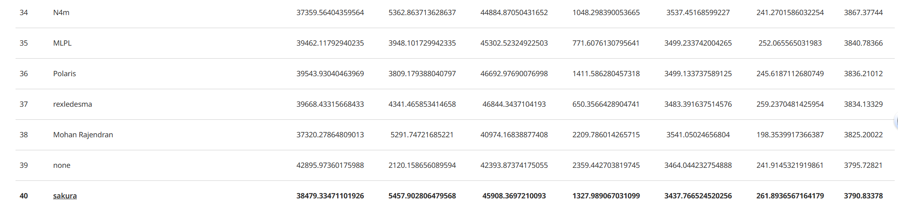
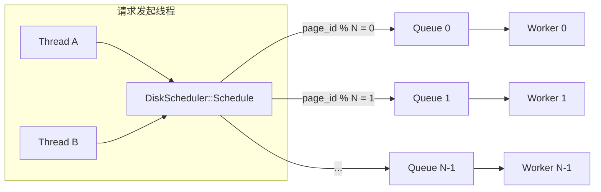
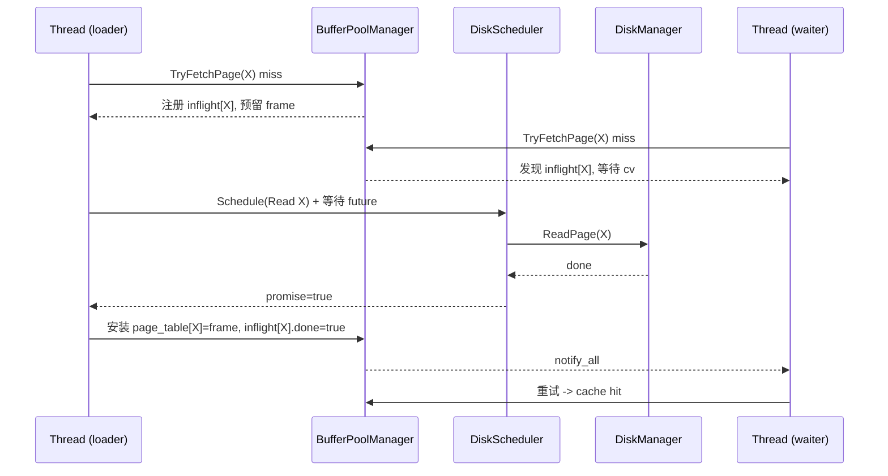
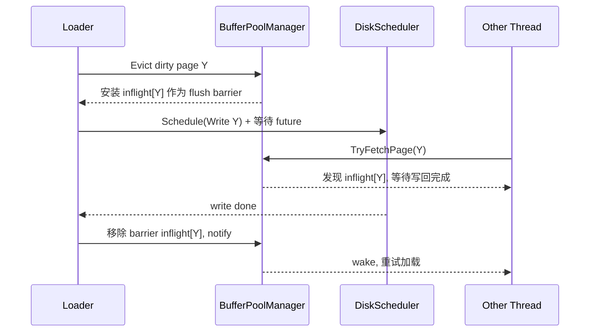
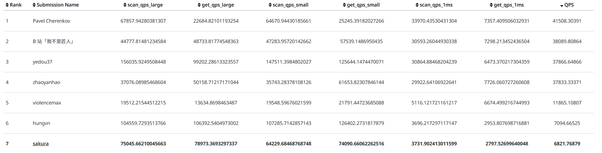

## 1. 项目目标
具体的project要求的任务请到[CMU官方课程网站](https://15445.courses.cs.cmu.edu/fall2025/project1/)查看
Project 1 要实现一个**线程安全**的 Buffer Pool Manager（BPM），负责在内存 frame 与磁盘 page 之间搬运 8KB 数据页，并提供统一的读写访问接口。

project1在代码层面分为四块（对应课程网页的任务划分）：

- Task 1：ARC 替换策略（`ArcReplacer`）
- Task 2：磁盘调度器（`DiskScheduler`，后台 worker 线程处理读写请求）
- Task 3：缓冲池管理器（`BufferPoolManager`，页表、free list、驱逐、I/O）
- Task 3（并发子任务）：Page Guards（`ReadPageGuard` / `WritePageGuard`，RAII + 读写锁）
## 2. 基本概念：Page vs Frame

- **page**：磁盘上（或逻辑上）用 `page_id_t` 标识的一页数据（BusTub 中固定大小 8KB）。
- **frame**：内存中的一块 8KB buffer（用 `frame_id_t` 标识），用于临时装载某个 page 的内容。

BPM 需要维护：

- `page_table_`：`page_id -> frame_id` 映射（保证同一个 page 在内存中只有 1 份）
- `frames_`：所有 frame 的元数据 + 实际 8KB buffer（封装在 `FrameHeader`）
- `free_frames_`：空闲 frame 列表
- `replacer_`：选择可驱逐 frame 的策略（本项目是 ARC）
## 3. 并发模型与锁

这个项目使用两层同步：

1. **BPM 全局互斥锁**：`BufferPoolManager::bpm_latch_`（`std::mutex`）
   - 保护：`page_table_` / `free_frames_` / `inflight_loads_` / 以及与 replacer 状态联动的关键元数据更新
2. **每个 frame 的读写锁**：`FrameHeader::rwlatch_`（`std::shared_mutex`）
   - `ReadPageGuard` 获取 shared lock
   - `WritePageGuard` 获取 exclusive lock

此外：

- `FrameHeader::pin_count_` 是 `std::atomic<size_t>`，用于标识当前有多少 guard 正在使用该 frame。
- `ArcReplacer::SetEvictable(frame_id, ...)` 与 pin_count 需要保持一致：pin 从 1→0 时标记可驱逐。
## 4. Task1-Adaptive Replacement Cache (ARC) Replacement Policy
关于ARC算法，可以看看[这篇博客](/posts/arc-algorithm/)
ARC 的核心是 4 个 list + 一个可自适应的目标参数 $p$：

- `mru_`：最近只访问过 1 次的“活页”（alive，存 frame_id）
- `mfu_`：访问过多次的“活页”（alive，存 frame_id）
- `mru_ghost_`：从 MRU 驱逐出去的“幽灵页”（ghost，存 page_id）
- `mfu_ghost_`：从 MFU 驱逐出去的“幽灵页”（ghost，存 page_id）
- `mru_target_size_`：目标 MRU 大小（课程文档里的 p）
### 4.1 RecordAccess 的 4 类情况

`RecordAccess(frame_id, page_id)` 大体是：

1.页面已存在于MRU/MFU中：这是实际缓存命中的情况。将页面移至MFU的前端。
2.页面已存在于MRU幽灵列表中：这是实际缓存未命中但在幽灵列表中命中的情况。在这种情况下，我们将其视为伪命中并调整目标大小。如果MRU幽灵列表的大小大于或等于MFU幽灵列表的大小，则将MRU目标大小增加1。否则，将其增加MFU幽灵列表大小除以MRU幽灵列表大小（向下取整）。不要将目标大小增加到超过替换器大小。然后将页面移至MFU的前端。其原理是，如果MRU列表稍大一些，数据库管理系统本可以实现缓存命中。
3.页面已存在于MFU幽灵列表中：与前一种情况类似，这是实际缓存未命中但在幽灵列表中命中的情况。如果MFU幽灵列表的大小大于或等于MRU幽灵列表的大小，则将MRU目标大小减少1。否则，将其减少MRU幽灵列表大小除以MFU幽灵列表大小（向下取整）。不要将目标大小减少到0以下。然后将页面移至MFU的前端。其原理是，如果MFU列表稍大一些，数据库管理系统本可以实现缓存命中。
4. 页面不在替换器中：这是实际缓存未命中且幽灵列表也未命中的情况。此时应执行以下操作之一。
- a. 如果MRU大小 + MRU幽灵列表大小 = 替换器大小：删除MRU幽灵列表中的最后一个元素，然后将该页面添加到MRU的前端。
- b. 否则，MRU大小 + MRU幽灵列表大小应小于替换器大小（如果操作正确，它永远不会更大）。在这种情况下如果MRU大小 + MRU幽灵列表大小 + MFU大小 + MFU幽灵列表大小 = 2 *替换器大小：删除MFU幽灵列表中的最后一个元素，然后将该页面添加到MRU的前端。 否则，只需将该页面添加到MRU的前端。

### 4.2 Evict 的选择规则

- 当 `mru_.size() >= mru_target_size_`：优先从 MRU 侧找 victim；否则优先 MFU。
- 只允许驱逐 `evictable_ == true` 的 frame（被 pin 的跳过）。
- 找不到就换另一侧；两侧都没有 evictable 则返回 `std::nullopt`。

## 5. Task2-DiskScheduler

课程要求：提供一个后台线程（或线程组）处理 `DiskRequest`，并在完成后 `promise.set_value(true)` 通知调用者。

## 6. Task3-BufferPoolManager
### 6.1 PageGuard 的 RAII 语义

- 构造有效 guard 时立刻对 `frame_->rwlatch_` 加锁：
  - `ReadPageGuard`：`lock_shared()`
  - `WritePageGuard`：`lock()`
- `Drop()` / 析构：释放 latch，并将 pin_count 减 1。
- 当 pin_count 从 1 降到 0：调用 `replacer_->SetEvictable(frame_id, true)`。
### 6.2 BPM的实现要点
BPM 对外最重要的接口是：

- `CheckedReadPage(page_id)` / `CheckedWritePage(page_id)`：获取数据页上的可选读或写锁定保护。用户可根据需要指定`AccessType`。如果无法将数据页载入内存，此函数将返回`std::nullopt`。。
- `ReadPage(page_id)` / `WritePage(page_id)`：失败直接 `abort()`。
- `NewPage()`：分配一个新的 page_id，并把对应页装入一个 frame。
- `DeletePage(page_id)`：若 pinned 则失败；否则从内存/磁盘移除。
#### 6.2.1 `NewPage`
`NewPage()` 做两件事：

- 分配新的 `page_id`
- 为该 page 找到一个 frame：
  - 优先去空闲帧列表 `free_frames_` 寻找
  - 否则调用 `replacer_->Evict()` 找 victim，替换掉一个frame
    - 若 victim dirty：通过 `DiskScheduler` 写回，等待完成
    - 从 `page_table_` 移除 victim 的映射

然后 `frame->Reset()`，更新 `frame->page_id_` 并加入 `page_table_`。
#### 6.2.2 `CheckedReadPage(page_id)` / `CheckedWritePage(page_id)`
两者结构类似：
- 1.先去寻找内存中是否有page_id对应的frame，如果`page_table_`中没有，流程跟`NewPage()`一样，
  - 优先去空闲帧列表 `free_frames_` 寻找内存是否有空闲frame，
  - 否则调用 `replacer_->Evict()` 找 victim，替换掉一个frame
- 2.构造对应 guard：
   - `ReadPageGuard(page_id, frame, ...)`
   - `WritePageGuard(page_id, frame, ...)`
  
guard 的构造会去锁 frame 的 `rwlatch_`，从而保证真正的数据访问是线程安全的。
#### 6.2.3 `DeletePage`

- 如果 page 不在内存：直接返回 `true`（视为“已删除”）。
- 如果在内存且 `pin_count_ > 0`：返回 `false`。
- 否则：
  - `replacer_->Remove(frame_id)`（要求 evictable，否则抛异常）
  - 从 `page_table_` 删除
  - frame reset 并归还 `free_frames_`
  - `disk_scheduler_->DeallocatePage(page_id)` 释放磁盘空间
## 7. 测试结果

没有经过优化，排名并不高，qps也只有3790

这是网站推荐可以做的优化

- 更好的替换算法。鉴于获取工作负载是倾斜的（即，某些页面比其他页面更频繁地被访问），您可以设计您的 ARC 替换器以考虑页面访问类型，以减少页面未命中。考虑如何排队多个请求并预取数据。
- 并行 I/O 操作。在您的磁盘调度程序中一次处理一个请求，而不是同时向磁盘管理器发出多个请求。这种优化在现代存储设备中非常有用，其中对磁盘的并发访问可以更好地利用磁盘带宽。您应该处理同一页面的多个操作在队列中的情况，并且这些请求的最终结果应如同它们按顺序处理一样。在单个线程中，它们应该具有读后写一致性。
- 要在磁盘调度器中实现真正的并行性，您还需要允许您的缓冲池管理器能够同时处理多个 `ReadPage` 和 `WritePage` 请求以及驱逐多个页面。您可能需要在您的缓冲池管理器中引入一个条件变量来管理空闲页面。

## 8 优化
### 8.1 DiskScheduler：多 worker + `page_id` 分片队列（并行但保持同页顺序）
- **多 worker 并行处理**：用 `NUM_WORKER_THREADS` 个后台线程消费请求。
- **按 `page_id % NUM_WORKER_THREADS` 路由到固定队列**：保证同一个 page 的请求不会被并发执行，从而满足“同页 read-after-write 顺序性”的直觉要求。

整体结构示意（按 page 分片）：

实现取舍：

- 优点：不同 page 的 I/O 可以真正并行；同 page 的请求天然串行，省掉额外的 per-page mutex/排序逻辑。
- 代价：workload 极端偏斜（大量请求集中在少数 page）时，热点 page 会被固定映射到某个 worker，可能形成单队列瓶颈。
### 8.2 BPM：`inflight_loads_` 去重 + eviction 的 flush barrier（防重复读/写-读乱序）
在IO期间不持有`bpm_latch_`,其他线程可以读取不同`page_id`对应的`frame`,读取同一`page_id`会阻塞等待重试
引入：

- `inflight_loads_[page_id] = PageLoadState{mutex, cv, done, ok}`：
  - **对正在加载的目标页 X**：实现“单 loader + 多 waiter”。
  - **对正在写回的被驱逐页 Y**：作为 flush barrier，阻止其他线程在写回完成前重新加载 Y。

#### 8.2.1 单页加载：单 loader，多 waiter（避免重复 I/O）

#### 8.2.2 驱逐 dirty 页：flush barrier（避免写回期间被重新读入）

当 loader 选中 victim frame 且 victim 是 dirty 页 Y 时，会先在 `inflight_loads_` 里为 Y 放一个 barrier。

## 9. 优化后的测试结果
